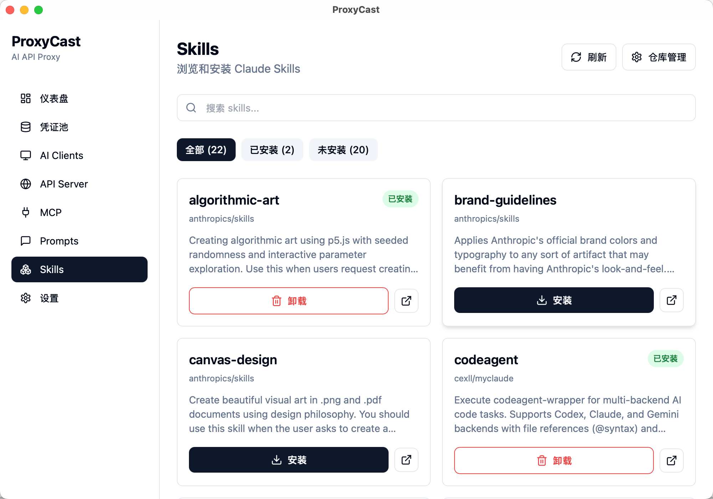
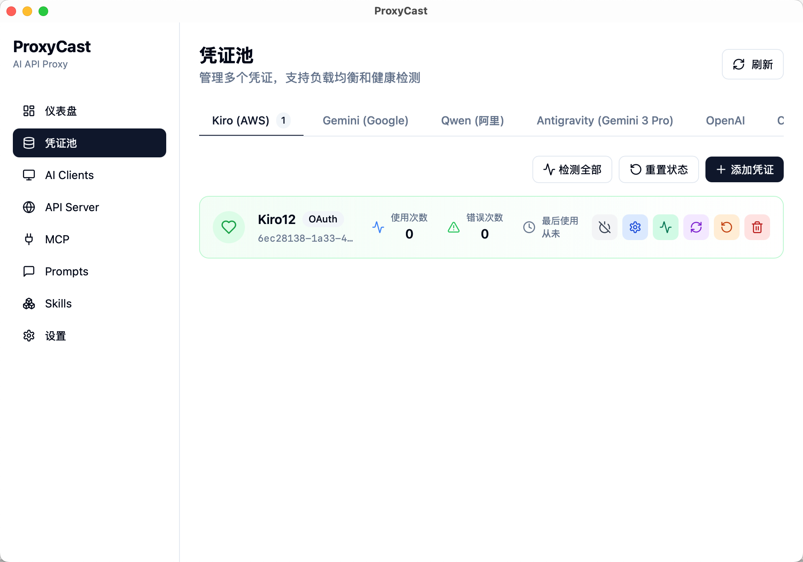
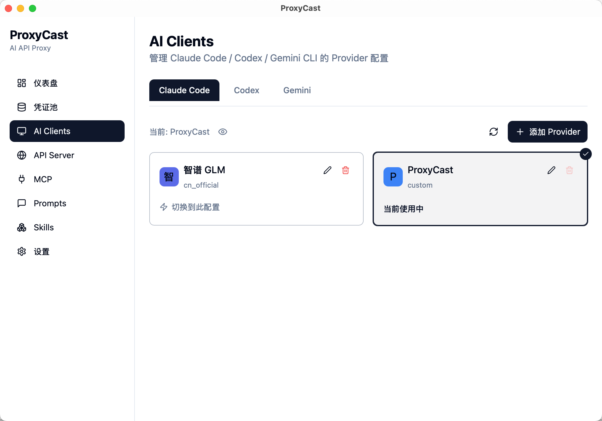
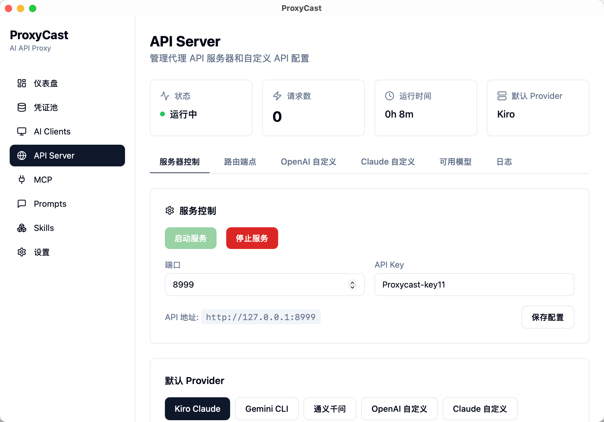
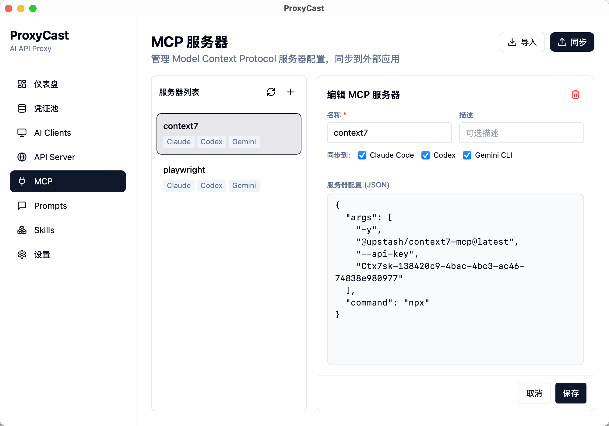
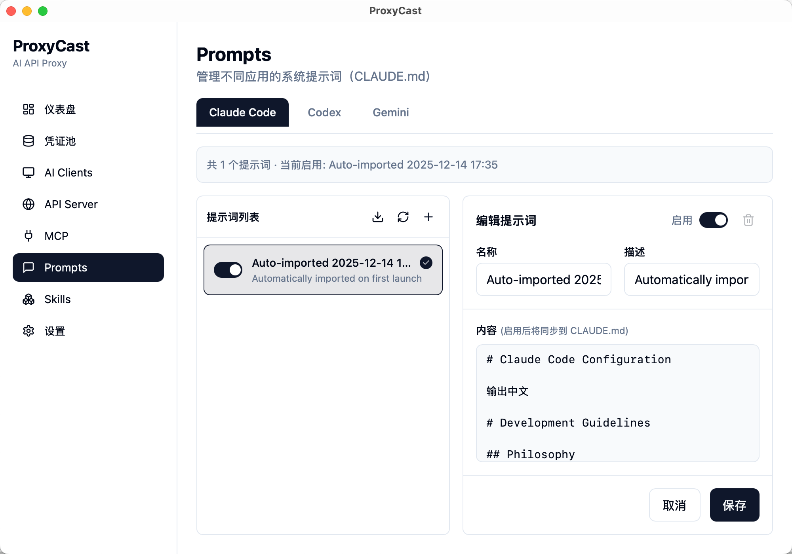
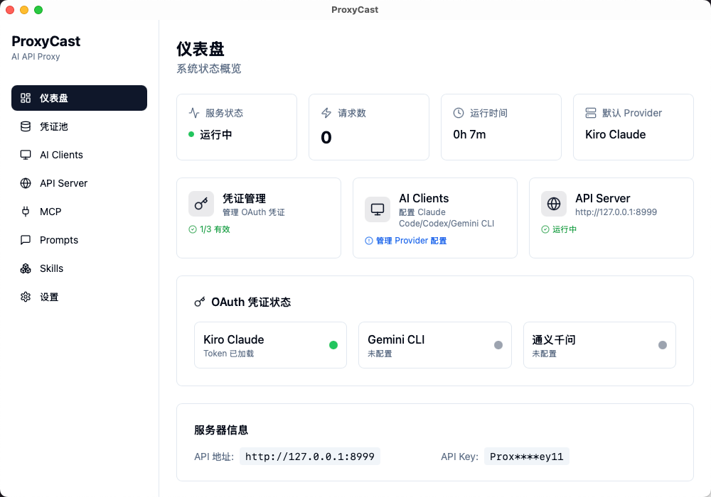

<div align="center">

# ProxyCast 🚀

**一款强大的桌面应用，将各种大模型客户端 API（Kiro Claude、Gemini CLI、通义千问等）统一转换为本地 OpenAI 兼容接口。**

[](https://www.gnu.org/licenses/gpl-3.0)
[](https://tauri.app/)
[](https://react.dev/)
[](https://www.rust-lang.org/)

</div>

---

ProxyCast 是一款基于 Tauri 2.0 + React 18 + Rust 构建的跨平台桌面应用，能够将原本仅限客户端使用的免费大模型（如 Kiro Claude、Gemini CLI、通义千问）转换为标准 OpenAI 兼容接口，让 Cherry-Studio、NextChat、Cline 等工具可以自由调用 Claude Sonnet 4.5、Gemini 2.5 Flash、Qwen3 Coder Plus 等高级模型。

> **💡 与 AIClient-2-API 的区别**
> 
> ProxyCast 是 [AIClient-2-API](https://github.com/justlovemaki/AIClient-2-API) 的桌面版本，提供更友好的图形界面和一键操作体验，无需命令行配置。

---

## ✨ 核心特性

### 🎯 多 Provider 统一管理
- **Kiro Claude** - 通过 OAuth 免费使用 Claude Sonnet 4.5
- **Gemini CLI** - 通过 OAuth 突破 Gemini 免费限制
- **通义千问** - 通过 OAuth 使用 Qwen3 Coder Plus
- **OpenAI 自定义** - 配置自定义 OpenAI 兼容 API
- **Claude 自定义** - 配置自定义 Claude API

### 🖥️ 友好的图形界面
- **Dashboard** - 服务状态监控、API 测试面板
- **Provider 管理** - 一键加载凭证、Token 刷新、默认 Provider 切换
- **设置页面** - 服务器配置、端口设置、API Key 管理
- **日志查看** - 实时日志记录、操作追踪

### 🔄 智能凭证管理
- 自动检测凭证文件变化（每 5 秒）
- 一键读取本地 OAuth 凭证
- Token 过期自动刷新
- 环境变量导出（.env 格式）

### 🌐 完整 API 兼容
- `/v1/chat/completions` - OpenAI Chat API
- `/v1/models` - 模型列表
- `/v1/messages` - Anthropic Messages API
- `/v1/messages/count_tokens` - Token 计数

---

## 📸 界面截图

### Dashboard - 服务控制与 API 测试


### 凭证池 - 多凭证管理


### API Server - 路由与日志


### 设置页面 - 服务器配置


### AI Clients - 客户端配置


### MCP 服务器管理


### Prompts 管理


---

## 🚀 快速开始

### 下载安装

从 [Releases](https://github.com/aiclientproxy/proxycast/releases) 页面下载对应平台的安装包：

- **macOS (Apple Silicon)**: `ProxyCast_x.x.x_aarch64.dmg`
- **Windows (x64)**: `ProxyCast_x.x.x_x64-setup.exe`

### 凭证文件位置

| Provider | 默认路径 | 说明 |
|----------|---------|------|
| **Kiro** | `~/.aws/sso/cache/kiro-auth-token.json` | Kiro OAuth Token |
| **Gemini** | `~/.gemini/oauth_creds.json` | Gemini CLI OAuth |
| **Qwen** | `~/.qwen/oauth_creds.json` | 通义千问 OAuth |

> **提示**: `~` 表示用户主目录（macOS: `/Users/用户名`，Windows: `C:\Users\用户名`）

### 使用步骤

1. **启动应用** - 打开 ProxyCast
2. **加载凭证** - 进入 Provider 管理页面，点击"一键读取凭证"
3. **启动服务** - 在 Dashboard 点击"启动服务器"
4. **配置客户端** - 在 Cherry-Studio、Cline 等工具中配置：
   ```
   API Base URL: http://localhost:3001/v1
   API Key: proxycast-key
   ```

---

## 🔧 API 使用示例

### OpenAI Chat Completions

```bash
curl http://localhost:3001/v1/chat/completions \
  -H "Content-Type: application/json" \
  -H "Authorization: Bearer proxycast-key" \
  -d '{
    "model": "claude-sonnet-4-5-20250514",
    "messages": [
      {"role": "user", "content": "Hello!"}
    ],
    "stream": true
  }'
```

### Anthropic Messages API

```bash
curl http://localhost:3001/v1/messages \
  -H "Content-Type: application/json" \
  -H "x-api-key: proxycast-key" \
  -H "anthropic-version: 2023-06-01" \
  -d '{
    "model": "claude-sonnet-4-5-20250514",
    "max_tokens": 1024,
    "messages": [
      {"role": "user", "content": "Hello!"}
    ]
  }'
```

---

## 🛠️ 开发构建

### 环境要求

- Node.js >= 20.0.0
- Rust >= 1.70
- pnpm 或 npm

### 本地开发

```bash
# 安装依赖
npm install

# 启动开发服务器
npm run tauri dev
```

### 构建发布

```bash
# 构建生产版本
npm run tauri build
```

---

## 📄 开源协议

本项目采用 [GNU General Public License v3 (GPLv3)](https://www.gnu.org/licenses/gpl-3.0) 协议开源。

## 🙏 致谢

- [AIClient-2-API](https://github.com/justlovemaki/AIClient-2-API) - 核心逻辑参考
- [Tauri](https://tauri.app/) - 跨平台桌面框架
- [shadcn/ui](https://ui.shadcn.com/) - UI 组件库

---

## ⚠️ 免责声明

### 使用风险提示
本项目（ProxyCast）仅供学习和研究使用。用户在使用本项目时需自行承担所有风险。作者不对因使用本项目而导致的任何直接、间接或后果性损失负责。

### 第三方服务责任声明
本项目是一个 API 代理工具，不提供任何 AI 模型服务。所有 AI 模型服务均由各自的第三方提供商（如 Google、Anthropic、阿里云等）提供。用户在通过本项目访问这些服务时，应遵守各第三方服务的使用条款和政策。

### 数据隐私声明
本项目在本地运行，不收集或上传任何用户数据。但用户在使用本项目时应保护好自己的 API 密钥和其他敏感信息。
